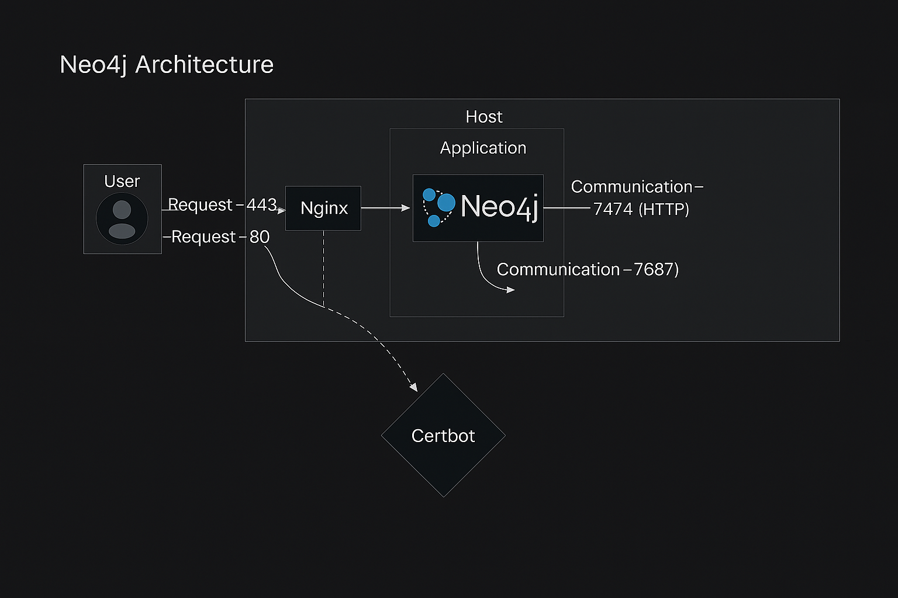

# Neo4j Containerized Architecture

This repository sets up a containerized environment for the **Neo4j** graph database with a secure, web-accessible interface using **Nginx** and **Certbot**.

---

## Architecture Overview

This architecture includes:

- **Neo4j**: A graph database server accessible via browser and Bolt protocol
- **Nginx**: A reverse proxy that routes HTTPS traffic to Neo4j
- **Certbot**: Automates SSL certificate issuance via Let's Encrypt




---

## Components & Ports

| Component | Role | Ports |
|-----------|------|-------|
| **Neo4j** | Graph DB & Browser UI | `7474` (HTTP), `7687` (Bolt) |
| **Nginx** | Reverse Proxy | `80` (HTTP), `443` (HTTPS) |
| **Certbot** | SSL Certificate Management | – |

---

## Design Decisions

- **Web UI**: Neo4j Browser on port `7474` for ease of access
- **HTTPS enabled**: via Nginx + Certbot for public-facing deployments
- **Python integration**: `neo4j` package included for scripting/querying

---

## Trade-offs

- **Community Edition** used instead of Enterprise (no clustering)
- **No load balancer** due to single-node scope
- **Minimal setup** to keep deployment easy and reproducible

---

## Assumptions

- Docker/Docker Compose is available
- Public domain is available (if using HTTPS)
- Intended for small-scale research or prototyping

---

## Requirements (Python Side)

Include this in your `requirements.txt` if you're interacting with Neo4j from Python:

```txt
neo4j==5.14.0
pandas
numpy
networkx
plotly
dash
dash-cytoscape
notebook
```

---


